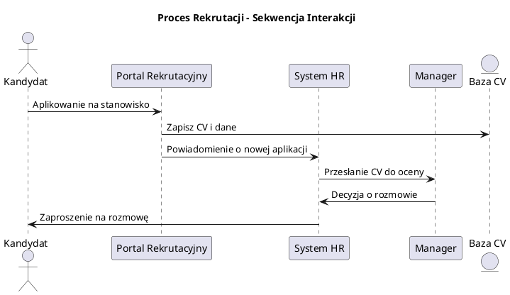
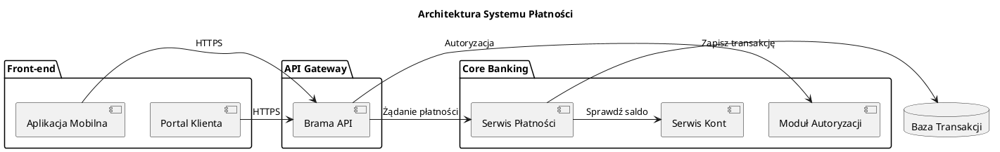

# 📄 Integracja PDF z generatorem diagramów PlantUML

## 🎯 Przegląd funkcjonalności

Rozszerzenie pozwala na wykorzystanie dokumentów PDF jako źródła kontekstu biznesowego dla generowania bardziej precyzyjnych i kompletnych diagramów PlantUML/XMI.

## 🚀 Instalacja i konfiguracja

### 1. Zainstaluj dodatkowe zależności

```bash
pip install PyPDF2 PyMuPDF python-docx openpyxl
```

### 2. Struktura plików

```
utils/
├── pdf/
│   ├── __init__.py
│   ├── pdf_processor.py          # Główny procesor PDF
│   └── streamlit_pdf_integration.py  # Integracja z UI
├── mcp/
│   ├── __init__.py
│   └── pdf_context_server.py     # MCP Server (opcjonalny)
└── cache/
    └── pdf/                      # Cache przetworzonych plików
```

## 📖 Jak używać

### Podstawowe użycie w Streamlit

1. **Uruchom aplikację Streamlit**:
   ```bash
   streamlit run streamlit_app.py
   ```

2. **Wgraj pliki PDF**:
   - W interfejsie znajdź sekcję "📄 Dodatkowy kontekst z plików PDF"
   - Przeciągnij lub wybierz pliki PDF zawierające dokumentację procesów
   - Poczekaj na automatyczne przetworzenie

3. **Generuj diagram**:
   - Opisz swój proces w polu tekstowym
   - Wybierz typ diagramu
   - Kliknij "Wygeneruj diagram"
   - Kontekst z PDF zostanie automatycznie dodany do promptu

### Przykłady dokumentów PDF, które działają najlepiej

#### ✅ Zalecane typy dokumentów:

- **Dokumentacja procesów biznesowych**
  - Opisy procedur
  - Instrukcje operacyjne
  - Polityki i regulaminy

- **Specyfikacje techniczne**
  - Diagramy architektury
  - Specyfikacje API
  - Dokumentacja systemów

- **Dokumenty analizy biznesowej**
  - User stories
  - Wymagania funkcjonalne
  - Przypadki użycia

#### ❌ Nieoptymalne dokumenty:

- Zeskanowane dokumenty bez OCR
- Dokumenty czysto graficzne
- Tabele bez opisów tekstowych

## 🔧 Funkcjonalności

### 1. Automatyczna ekstrakcja kontekstu

System automatycznie rozpoznaje:

- **Aktorów procesu**: użytkownicy, role, departamenty
- **Aktywności biznesowe**: kroki, operacje, procedury  
- **Systemy**: aplikacje, bazy danych, API
- **Punkty decyzyjne**: warunki, reguły biznesowe
- **Przepływy danych**: wejścia, wyjścia, transformacje

### 2. Dostosowanie do typu diagramu

**Diagram sekwencji**:
```
KONTEKST Z PDF: Proces obsługi zamówienia
UCZESTNICY PROCESU:
- Klient
- System e-commerce  
- Magazyn
- System płatności

GŁÓWNE AKTYWNOŚCI:
- Składanie zamówienia
- Weryfikacja dostępności
- Przetwarzanie płatności
- Przygotowanie wysyłki
```

**Diagram aktywności**:
```
SEKWENCJA DZIAŁAŃ:
1. Rozpoczęcie procesu przez klienta
2. Wprowadzenie danych zamówienia
3. Walidacja danych produktu
4. Sprawdzenie stanu magazynu
5. Kalkulacja kosztów
6. Proces płatności
7. Generowanie dokumentów
8. Przygotowanie do wysyłki
```

### 3. Cache i optymalizacja

- Automatyczne cache'owanie przetworzonych dokumentów
- Szybkie przetwarzanie przy ponownym użyciu
- Inteligentne wykrywanie zmian w plikach

### 4. Podgląd kontekstu

Możliwość podejrzenia ekstraktowanego kontekstu przed generowaniem:

```
🔍 Podgląd kontekstu z PDF

Proces: Obsługa reklamacji klienta
Aktorzy: Klient, Agent obsługi, Zespół techniczny  
Systemy: CRM, System ticketów, Baza wiedzy
Kluczowe aktywności: Zgłoszenie, Analiza, Rozwiązanie, Zamknięcie
```

## 🛠️ Konfiguracja zaawansowana

### Dostosowanie wzorców ekstraktycznych

W pliku `pdf_processor.py` możesz dostosować wzorce:

```python
self.patterns = {
    'actors': [
        r'(?:użytkownik|klient|pracownik|administrator)',
        r'(?:role|rola):\s*([^.\n]+)',
        # Dodaj własne wzorce
    ],
    'systems': [
        r'(?:system|aplikacja|baza danych)',
        r'(?:API|interface|serwis)',
        # Dodaj własne wzorce  
    ]
}
```

### Opcje przetwarzania

Dostępne tryby kontekstu:
- **Automatyczny**: Dostosowany do typu diagramu
- **Pełny tekst**: Wykorzystuje całą treść dokumentu
- **Kluczowe elementy**: Tylko aktorzy, procesy, systemy

## 🔍 Rozwiązywanie problemów

### Problem: PDF nie przetwarza się poprawnie

**Rozwiązanie**:
1. Sprawdź czy plik nie jest zaszyfrowany
2. Upewnij się że to nie jest zeskanowany dokument
3. Sprawdź logi aplikacji (`streamlit_app.log`)

### Problem: Słaba jakość ekstraktowanego kontekstu

**Rozwiązanie**:
1. Używaj dokumentów z jasną strukturą tekstową
2. Upewnij się że dokument zawiera opisy procesów, nie tylko grafiki
3. Dostosuj wzorce ekstraktacyjne do Twojej domeny

### Problem: Wolne przetwarzanie

**Rozwiązanie**:
1. Włącz cache (`use_cache=True`)
2. Używaj mniejszych plików PDF
3. Rozważ użycie MCP servera dla większej wydajności

## 📊 Metryki i monitorowanie

System automatycznie loguje:
- Czas przetwarzania dokumentów
- Jakość ekstraktowanego kontekstu
- Statystyki użycia cache

Sprawdź logi w:
- `streamlit_app.log` - główne operacje
- `utils/logs/pdf_processing.log` - szczegóły PDF

## 🚀 Integracja z MCP Server (Zaawansowane)

Dla większych projektów, uruchom dedykowany MCP server:

```bash
python -m utils.mcp.pdf_context_server
```

**Korzyści**:
- Lepka wydajność dla wielu dokumentów
- Zaawansowane wyszukiwanie semantyczne  
- API dla integracji z innymi narzędziami

## 📈 Przykłady użycia

### 1. Dokumentacja procesu rekrutacji

**Wgrany PDF**: `Proces_rekrutacji_2024.pdf`

**Wynik**:


### 2. Specyfikacja systemu bankowego

**Wgrany PDF**: `Spec_system_platnosci.pdf`

**Wynik**:


## 🎯 Najlepsze praktyki

### 1. Przygotowanie dokumentów PDF

- Używaj dokumentów z wyraźną strukturą
- Unikaj pure-graficznych diagramów
- Upewnij się że tekst jest selektowalny

### 2. Optymalizacja promptów

- Łącz kontekst z PDF z precyzyjnym opisem procesu
- Wykorzystuj różne typy dokumentów dla kompleksowego obrazu
- Sprawdzaj podgląd kontekstu przed generowaniem

### 3. Zarządzanie plikami

- Organizuj pliki PDF w logiczne grupy
- Używaj opisowych nazw plików  
- Regularnie czyść cache w `utils/cache/pdf/`

## 🔮 Przyszłe rozszerzenia

Planowane funkcjonalności:
- **OCR**: Wsparcie dla zeskanowanych dokumentów
- **Semantic Search**: Zaawansowane wyszukiwanie semantyczne
- **Multi-format**: Wsparcie dla DOCX, XLSX, PowerPoint
- **AI Summary**: Automatyczne streszczenia dokumentów
- **Collaborative**: Wspólne adnotacje w zespole