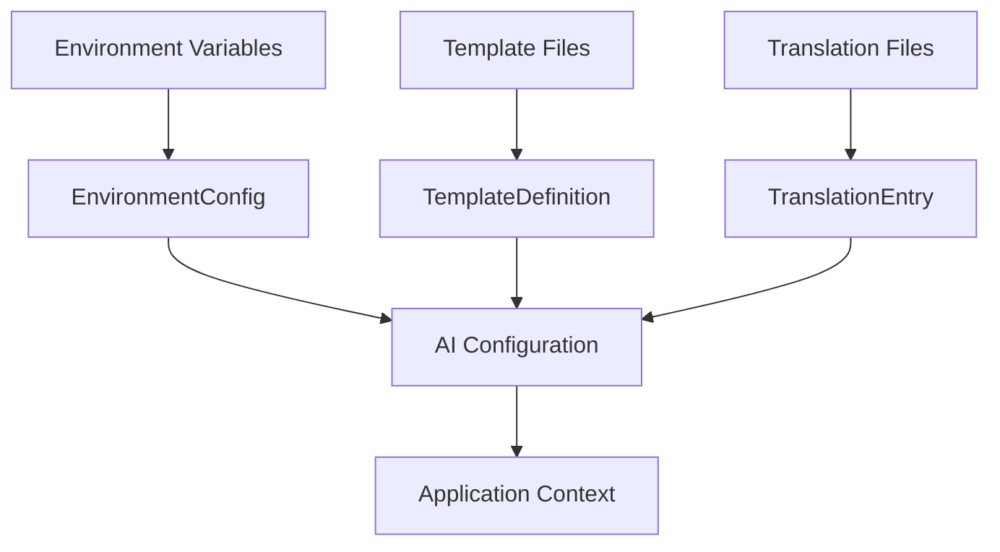
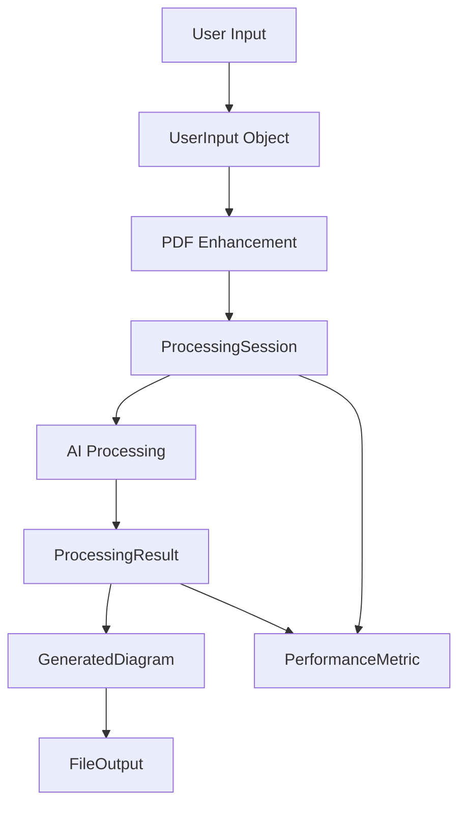
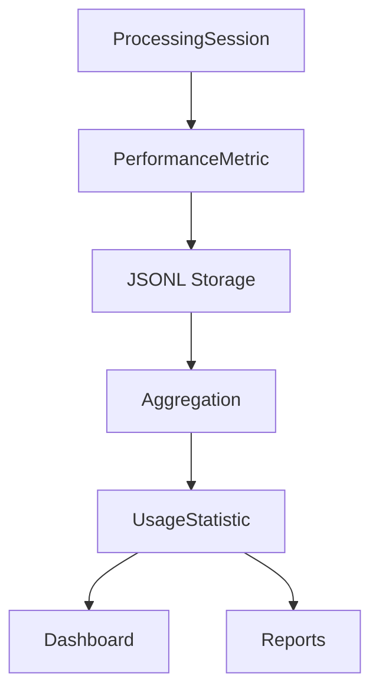

# Model Danych - System GD

## Przegląd Modelu Danych

System GD operuje na strukturach danych zoptymalizowanych pod kątem przetwarzania języka naturalnego, generowania diagramów i zarządzania metrykami. Model obejmuje dane konfiguracyjne, procesowe, wyjściowe oraz analityczne.

## 🗃️ Główne Domeny Danych

### 1. Configuration Domain
Zarządza konfiguracją AI providerów, szablonów i ustawień aplikacji.

### 2. Content Domain  
Przechowuje szablony promptów, tłumaczenia i dane wejściowe użytkowników.

### 3. Processing Domain
Obsługuje przepływ danych podczas generowania diagramów.

### 4. Output Domain
Zarządza wygenerowanymi diagramami i metadanymi.

### 5. Analytics Domain
Gromadzi metryki wydajności i użycia systemu.

## 📊 Szczegółowy Model Danych

### Configuration Domain

#### AIConfig
**Przeznaczenie**: Konfiguracja połączenia z AI providerami
```python
@dataclass
class AIConfig:
    provider: AIProvider                    # Typ providera (OPENAI, GEMINI, etc.)
    model: str                             # Model name (e.g., "gpt-4", "gemini-pro")
    api_key: str                           # Authentication key
    base_url: Optional[str] = None         # Custom API endpoint
    temperature: float = 0.7               # Creativeness (0.0-2.0)
    max_tokens: Optional[int] = None       # Response length limit
    timeout: int = 30                      # Request timeout in seconds
    retry_count: int = 3                   # Max retry attempts
    
    # BPMN specific settings
    quality_threshold: float = 0.8         # Minimum quality for BPMN
    max_iterations: int = 10               # Max optimization rounds
    
    def validate(self) -> bool:
        """Validates configuration parameters"""
        
    def to_dict(self) -> Dict[str, Any]:
        """Converts to dictionary for serialization"""
```

#### EnvironmentConfig
**Przeznaczenie**: Globalne ustawienia aplikacji
```python
@dataclass
class EnvironmentConfig:
    # Application settings
    language: str = "pl"                   # UI language (pl|en)
    plantuml_jar_path: str                 # Path to PlantUML JAR
    plantuml_generator_type: str = "local" # local|www
    
    # AI settings
    model_provider: str = "gemini"         # Default provider
    api_default_model: str                 # Default model name
    chat_url: str                          # AI API endpoint
    
    # PDF settings  
    pdf_analysis_mode: str = "ai"          # ai|basic
    pdf_max_pages: int = 50                # Max pages to process
    
    # Performance settings
    max_concurrent_requests: int = 5       # Parallel AI requests
    cache_enabled: bool = True             # Response caching
    
    @classmethod
    def from_env(cls) -> 'EnvironmentConfig':
        """Loads configuration from environment variables"""
```

### Content Domain

#### TemplateDefinition
**Przeznaczenie**: Definicja szablonów promptów
```python
@dataclass
class TemplateDefinition:
    name: str                              # Template identifier
    template: str                          # Prompt template with placeholders
    type: Literal["PlantUML", "XML", "BPMN"] # Output type
    allowed_diagram_types: Union[List[str], str] # Supported diagrams or "all"
    language: str                          # Template language (pl|en)
    complexity: str                        # basic|advanced|expert
    version: str = "1.0"                   # Template version
    
    # Metadata
    description: str = ""                  # Human readable description
    author: str = ""                       # Template author
    created_date: datetime                 # Creation timestamp
    tags: List[str] = field(default_factory=list) # Search tags
    
    def format(self, **kwargs) -> str:
        """Formats template with provided variables"""
        
    def validate_placeholders(self) -> List[str]:
        """Returns list of required placeholders"""
```

#### TranslationEntry
**Przeznaczenie**: Wielojęzyczne tłumaczenia
```python
@dataclass
class TranslationEntry:
    key: str                               # Translation key
    polish: str                            # Polish translation
    english: str                           # English translation
    context: str = ""                      # Usage context
    category: str = "general"              # Category (ui|error|business)
    
    def get(self, language: str) -> str:
        """Returns translation for specified language"""
```

#### UserInput
**Przeznaczenie**: Dane wejściowe od użytkownika
```python
@dataclass
class UserInput:
    content: str                           # Main process description
    diagram_type: str                      # Target diagram type
    template_name: Optional[str] = None    # Selected template
    language: str = "pl"                   # User language preference
    
    # PDF context
    pdf_files: List[str] = field(default_factory=list) # PDF file paths
    pdf_context: str = ""                  # Extracted PDF text
    
    # User preferences
    use_template: bool = True              # Apply template
    complexity_level: str = "medium"       # simple|medium|complex
    output_format: str = "standard"        # standard|detailed|minimal
    
    # Session data
    session_id: str = field(default_factory=lambda: str(uuid4()))
    timestamp: datetime = field(default_factory=datetime.now)
    user_id: Optional[str] = None          # For multi-user scenarios
    
    def enhance_with_pdf(self, pdf_processor) -> str:
        """Enhances input with PDF context"""
```

### Processing Domain

#### ProcessingSession
**Przeznaczenie**: Kontekst sesji przetwarzania
```python
@dataclass
class ProcessingSession:
    session_id: str                        # Unique session identifier
    user_input: UserInput                  # Original user input
    ai_config: AIConfig                    # AI configuration used
    
    # Processing state
    status: Literal["started", "processing", "completed", "failed"]
    current_step: str = ""                 # Current processing step
    progress_percentage: float = 0.0       # Completion percentage
    
    # Timing
    start_time: datetime = field(default_factory=datetime.now)
    end_time: Optional[datetime] = None
    processing_time: float = 0.0           # Total processing time in seconds
    
    # Error handling
    error_message: Optional[str] = None    # Error description
    retry_count: int = 0                   # Number of retries
    
    # Results
    intermediate_results: List[str] = field(default_factory=list)
    final_result: Optional['ProcessingResult'] = None
```

#### ProcessingResult
**Przeznaczenie**: Wynik procesu generowania
```python
@dataclass
class ProcessingResult:
    success: bool                          # Overall success flag
    content: str                           # Generated content (PlantUML/BPMN/XML)
    content_type: str                      # Content format
    
    # Quality metrics
    quality_score: Optional[float] = None  # Quality score (0.0-1.0)
    validation_results: Dict[str, Any] = field(default_factory=dict)
    
    # Processing metadata
    model_used: str = ""                   # AI model used
    provider_used: str = ""                # AI provider used
    processing_time: float = 0.0           # Generation time
    token_usage: Dict[str, int] = field(default_factory=dict) # Token consumption
    
    # BPMN specific
    iterations_performed: int = 0          # Number of optimization iterations
    improvement_history: List[float] = field(default_factory=list) # Quality progression
    
    # Error information
    error_message: Optional[str] = None    # Error description
    warning_messages: List[str] = field(default_factory=list) # Warnings
    
    def to_dict(self) -> Dict[str, Any]:
        """Converts result to dictionary for storage"""
```

### Output Domain

#### GeneratedDiagram
**Przeznaczenie**: Przechowywanie wygenerowanych diagramów
```python
@dataclass
class GeneratedDiagram:
    diagram_id: str = field(default_factory=lambda: str(uuid4()))
    session_id: str                        # Reference to processing session
    
    # Content
    source_code: str                       # Original code (PlantUML/BPMN)
    diagram_type: str                      # sequence|activity|class|bpmn|etc.
    format_type: str                       # plantuml|bpmn|xml
    
    # Generated files
    svg_content: Optional[bytes] = None    # SVG representation
    png_content: Optional[bytes] = None    # PNG representation  
    xmi_content: Optional[str] = None      # XMI for Enterprise Architect
    
    # Metadata
    title: str = ""                        # Diagram title
    description: str = ""                  # Diagram description
    tags: List[str] = field(default_factory=list) # Search tags
    
    # Versioning
    version: int = 1                       # Diagram version
    parent_diagram_id: Optional[str] = None # Reference to previous version
    
    # Timestamps
    created_at: datetime = field(default_factory=datetime.now)
    updated_at: datetime = field(default_factory=datetime.now)
    
    def export_files(self, directory: str) -> Dict[str, str]:
        """Exports all formats to specified directory"""
```

#### FileOutput
**Przeznaczenie**: Zarządzanie plikami wyjściowymi
```python
@dataclass
class FileOutput:
    file_id: str = field(default_factory=lambda: str(uuid4()))
    diagram_id: str                        # Reference to diagram
    
    # File information
    filename: str                          # Generated filename
    file_path: str                         # Full file path
    file_size: int                         # Size in bytes
    file_format: str                       # Extension (.puml, .svg, .bpmn, etc.)
    mime_type: str                         # MIME type
    
    # Content hash for integrity
    content_hash: str                      # SHA-256 hash
    
    # Timestamps
    created_at: datetime = field(default_factory=datetime.now)
    last_accessed: Optional[datetime] = None
    
    def verify_integrity(self) -> bool:
        """Verifies file integrity using hash"""
```

### Analytics Domain

#### PerformanceMetric
**Przeznaczenie**: Metryki wydajności systemu
```python
@dataclass
class PerformanceMetric:
    metric_id: str = field(default_factory=lambda: str(uuid4()))
    
    # Request information
    session_id: str                        # Reference to session
    operation_type: str                    # generate_plantuml|generate_bpmn|etc.
    model_used: str                        # AI model name
    provider_used: str                     # AI provider
    
    # Performance data
    start_time: datetime                   # Operation start
    end_time: datetime                     # Operation end
    total_time: float                      # Total time in seconds
    ai_response_time: float                # AI API response time
    processing_time: float                 # Local processing time
    
    # Resource usage
    memory_used: Optional[int] = None      # Memory in MB
    tokens_consumed: Dict[str, int] = field(default_factory=dict) # Token usage
    
    # Quality metrics
    success: bool                          # Success flag
    quality_score: Optional[float] = None  # Quality score
    user_satisfaction: Optional[int] = None # User rating (1-5)
    
    # Error information
    error_type: Optional[str] = None       # Error category
    error_message: Optional[str] = None    # Error description
    
    def to_jsonl(self) -> str:
        """Converts to JSON Lines format for storage"""
```

#### UsageStatistic
**Przeznaczenie**: Statystyki użycia aplikacji
```python
@dataclass
class UsageStatistic:
    stat_id: str = field(default_factory=lambda: str(uuid4()))
    
    # Time period
    period_start: datetime                 # Period start
    period_end: datetime                   # Period end
    period_type: str                       # hourly|daily|weekly|monthly
    
    # Usage counts
    total_requests: int = 0                # Total requests in period
    successful_requests: int = 0           # Successful requests
    failed_requests: int = 0               # Failed requests
    
    # Feature usage
    plantuml_requests: int = 0             # PlantUML generations
    bpmn_requests: int = 0                 # BPMN generations
    pdf_processed: int = 0                 # PDFs processed
    
    # User activity
    unique_sessions: int = 0               # Unique sessions
    average_session_time: float = 0.0      # Average session duration
    
    # Performance
    average_response_time: float = 0.0     # Average response time
    median_response_time: float = 0.0      # Median response time
    p95_response_time: float = 0.0         # 95th percentile response time
    
    def calculate_success_rate(self) -> float:
        """Calculates success rate percentage"""
```

## 🔄 Przepływy Danych

### 1. Configuration Flow


### 2. Processing Flow


### 3. Analytics Flow


## 💾 Persystencja Danych

### File System Storage

#### Configuration Files
```
.env                           # Environment configuration
language/
├── translations_pl.py         # Polish translations
└── translations_en.py         # English translations

prompts/
├── prompt_templates_pl.py     # Polish templates
└── prompt_templates_en.py     # English templates
```

#### Output Files
```
outputs/
├── diagrams/
│   ├── {session_id}_diagram.puml
│   ├── {session_id}_diagram.svg
│   └── {session_id}_diagram.bpmn
├── logs/
│   ├── app.log                # Application logs
│   ├── performance.log        # Performance logs
│   └── error.log              # Error logs
└── metrics/
    └── model_metrics.jsonl    # Performance metrics
```

#### Temporary Files
```
temp/
├── pdf_extracts/              # Temporary PDF text
├── svg_cache/                 # Generated SVG cache
└── sessions/                  # Active session data
```

### Database Schema (Future)

#### Tables Structure
```sql
-- Configuration
CREATE TABLE ai_configs (
    id UUID PRIMARY KEY,
    provider VARCHAR(50),
    model VARCHAR(100),
    config_json JSONB,
    created_at TIMESTAMP DEFAULT NOW()
);

-- Processing Sessions
CREATE TABLE processing_sessions (
    session_id UUID PRIMARY KEY,
    user_input JSONB,
    ai_config_id UUID REFERENCES ai_configs(id),
    status VARCHAR(20),
    created_at TIMESTAMP DEFAULT NOW(),
    completed_at TIMESTAMP
);

-- Generated Diagrams
CREATE TABLE diagrams (
    diagram_id UUID PRIMARY KEY,
    session_id UUID REFERENCES processing_sessions(session_id),
    diagram_type VARCHAR(50),
    source_code TEXT,
    metadata JSONB,
    created_at TIMESTAMP DEFAULT NOW()
);

-- Performance Metrics
CREATE TABLE performance_metrics (
    metric_id UUID PRIMARY KEY,
    session_id UUID REFERENCES processing_sessions(session_id),
    operation_type VARCHAR(50),
    total_time FLOAT,
    success BOOLEAN,
    metrics_json JSONB,
    created_at TIMESTAMP DEFAULT NOW()
);
```

## 🔍 Validation & Constraints

### Data Validation Rules

#### AIConfig Validation
- `temperature`: 0.0 ≤ value ≤ 2.0
- `max_tokens`: 1 ≤ value ≤ 32000 (model dependent)
- `timeout`: 5 ≤ value ≤ 300 seconds
- `provider`: Must be valid AIProvider enum value

#### Quality Score Validation
- Range: 0.0 ≤ score ≤ 1.0
- BPMN target threshold: ≥ 0.8
- Improvement detection: new_score > previous_score

#### File Size Constraints
- PDF files: ≤ 100MB per file
- SVG output: ≤ 10MB per diagram
- Session data: ≤ 50MB per session

### Business Rules

#### BPMN Processing Rules
1. Minimum 1 iteration, maximum 15 iterations
2. Quality improvement required between iterations
3. Timeout after 5 minutes of processing
4. Automatic fallback to basic generation if optimization fails

#### Template Application Rules
1. Template must match selected diagram type
2. All required placeholders must be provided
3. Template language must match user preference
4. Complexity level affects prompt selection

## 📈 Data Analytics Model

### Metrics Collection Strategy

#### Real-time Metrics
- Request latency (P50, P95, P99)
- Success/failure rates
- Active session count
- Memory usage

#### Batch Metrics
- Daily usage statistics
- Model performance comparison
- Feature adoption rates
- User satisfaction scores

#### Dimensional Analysis
```
Dimensions: [time, user_segment, feature, model, provider]
Measures: [request_count, avg_latency, success_rate, quality_score]
```

---

*Model danych ewoluuje wraz z rozwojem funkcjonalności i wymagań analitycznych systemu.*