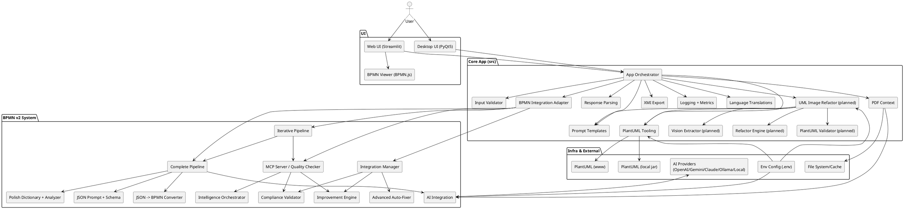
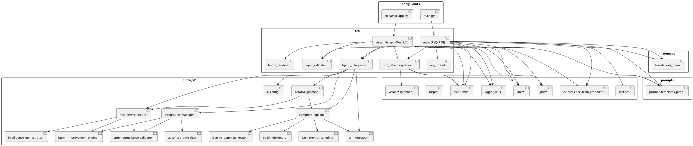

# Modular Architecture (PlantUML)

Planned changes: The additions below are planned and not yet implemented.

## Component View

```plantuml
@startuml
skinparam componentStyle rectangle
skinparam shadowing false

actor User

package "UI" {
  [Desktop UI (PyQt5)] as DesktopUI
  [Web UI (Streamlit)] as WebUI
  [BPMN Viewer (BPMN.js)] as BPMNViewer
}

package "Core App (src)" {
  [App Orchestrator] as CoreApp
  [Input Validator] as InputValidator
  [Prompt Templates] as PromptTemplates
  [Response Parsing] as ResponseParsing
  [PlantUML Tooling] as PlantUMLTooling
  [XMI Export] as XMIExport
  [Logging + Metrics] as LoggingMetrics
  [Language Translations] as Translations
  [BPMN Integration Adapter] as BPMNAdapter
  [PDF Context] as PDFContext
  [UML Image Refactor (planned)] as UMLImageRefactor
  [Vision Extractor (planned)] as UMLVision
  [Refactor Engine (planned)] as UMLRefactorEngine
  [PlantUML Validator (planned)] as UMLValidator
}

package "BPMN v2 System" {
  [Complete Pipeline] as BPMNPipeline
  [Iterative Pipeline] as IterativePipeline
  [Compliance Validator] as ComplianceValidator
  [Improvement Engine] as ImprovementEngine
  [Advanced Auto-Fixer] as AutoFixer
  [Integration Manager] as IntegrationManager
  [MCP Server / Quality Checker] as MCPServer
  [Intelligence Orchestrator] as IntelligenceOrch
  [JSON Prompt + Schema] as BPMNPrompt
  [JSON -> BPMN Converter] as BPMNConverter
  [Polish Dictionary + Analyzer] as PolishDict
  [AI Integration] as BPMNAI
}

package "Infra & External" {
  [Env Config (.env)] as EnvConfig
  [AI Providers\n(OpenAI/Gemini/Claude/Ollama/Local)] as AIProviders
  [PlantUML (local jar)] as PlantUMLLocal
  [PlantUML (www)] as PlantUMLWeb
  [File System/Cache] as FileCache
}

User --> DesktopUI
User --> WebUI

DesktopUI --> CoreApp
WebUI --> CoreApp

CoreApp --> InputValidator
CoreApp --> PromptTemplates
CoreApp --> ResponseParsing
CoreApp --> PlantUMLTooling
CoreApp --> XMIExport
CoreApp --> LoggingMetrics
CoreApp --> Translations
CoreApp --> PDFContext
CoreApp --> BPMNAdapter
CoreApp --> UMLImageRefactor

UMLImageRefactor --> UMLVision
UMLImageRefactor --> UMLRefactorEngine
UMLImageRefactor --> UMLValidator
UMLImageRefactor --> PromptTemplates
UMLImageRefactor --> PlantUMLTooling

PlantUMLTooling --> PlantUMLLocal
PlantUMLTooling --> PlantUMLWeb

WebUI --> BPMNViewer
BPMNAdapter --> BPMNPipeline
BPMNAdapter --> IterativePipeline
BPMNAdapter --> IntegrationManager
BPMNAdapter --> MCPServer

BPMNPipeline --> PolishDict
BPMNPipeline --> BPMNPrompt
BPMNPipeline --> BPMNConverter
BPMNPipeline --> BPMNAI

IterativePipeline --> BPMNPipeline
IterativePipeline --> MCPServer

IntegrationManager --> ImprovementEngine
IntegrationManager --> AutoFixer
IntegrationManager --> ComplianceValidator

MCPServer --> ComplianceValidator
MCPServer --> ImprovementEngine
MCPServer --> IntelligenceOrch

BPMNAI --> AIProviders
PDFContext --> FileCache
PDFContext --> BPMNAI
EnvConfig --> BPMNAI
EnvConfig --> PlantUMLTooling
EnvConfig --> UMLImageRefactor
@enduml
```

## Package Dependencies

```plantuml
@startuml
skinparam packageStyle rectangle
skinparam shadowing false

package "Entry Points" {
  [main.py] as MainEntry
  [streamlit_app.py] as StreamlitEntry
}

package "src" {
  [main (PyQt5 UI)] as SrcMain
  [streamlit_app (Web UI)] as SrcStreamlit
  [bpmn_integration] as SrcBpmnIntegration
  [bpmn_renderer] as SrcBpmnRenderer
  [api_thread] as SrcApiThread
  [input_validator] as SrcInputValidator
  [uml_refactor (planned)] as SrcUmlRefactor
}

package "utils" {
  [extract_code_from_response] as UtilsExtract
  [logger_utils] as UtilsLogger
  [metrics] as UtilsMetrics
  [plantuml/*] as UtilsPlantuml
  [xmi/*] as UtilsXmi
  [pdf/*] as UtilsPdf
  [mcp/*] as UtilsMcp
  [vision/* (planned)] as UtilsVision
}

package "prompts" {
  [prompt_templates_pl/en] as PromptTemplates
}

package "language" {
  [translations_pl/en] as Translations
}

package "bpmn_v2" {
  [complete_pipeline] as BpmnComplete
  [iterative_pipeline] as BpmnIterative
  [ai_config] as BpmnAIConfig
  [ai_integration] as BpmnAIIntegration
  [json_prompt_template] as BpmnJsonPrompt
  [json_to_bpmn_generator] as BpmnJsonToXml
  [polish_dictionary] as BpmnPolishDict
  [bpmn_compliance_validator] as BpmnValidator
  [bpmn_improvement_engine] as BpmnImprove
  [advanced_auto_fixer] as BpmnAutoFix
  [integration_manager] as BpmnIntegrationManager
  [mcp_server_simple] as BpmnMcp
  [intelligence_orchestrator] as BpmnIntelligence
}

MainEntry --> SrcMain
StreamlitEntry --> SrcStreamlit

SrcMain --> SrcApiThread
SrcMain --> SrcInputValidator
SrcMain --> PromptTemplates
SrcMain --> Translations
SrcMain --> UtilsExtract
SrcMain --> UtilsPlantuml
SrcMain --> UtilsXmi
SrcMain --> UtilsLogger
SrcMain --> UtilsMetrics
SrcMain --> SrcBpmnIntegration
SrcMain --> UtilsPdf
SrcMain --> SrcUmlRefactor

SrcStreamlit --> SrcInputValidator
SrcStreamlit --> PromptTemplates
SrcStreamlit --> Translations
SrcStreamlit --> UtilsExtract
SrcStreamlit --> UtilsPlantuml
SrcStreamlit --> UtilsXmi
SrcStreamlit --> UtilsLogger
SrcStreamlit --> SrcBpmnIntegration
SrcStreamlit --> SrcBpmnRenderer
SrcStreamlit --> UtilsPdf
SrcStreamlit --> SrcUmlRefactor

SrcBpmnIntegration --> BpmnComplete
SrcBpmnIntegration --> BpmnIterative
SrcBpmnIntegration --> BpmnIntegrationManager
SrcBpmnIntegration --> BpmnMcp
SrcBpmnIntegration --> BpmnAIIntegration
SrcBpmnIntegration --> BpmnAIConfig
SrcUmlRefactor --> PromptTemplates
SrcUmlRefactor --> UtilsPlantuml
SrcUmlRefactor --> UtilsVision

BpmnComplete --> BpmnPolishDict
BpmnComplete --> BpmnJsonPrompt
BpmnComplete --> BpmnJsonToXml
BpmnComplete --> BpmnAIIntegration

BpmnIterative --> BpmnComplete
BpmnIterative --> BpmnMcp

BpmnIntegrationManager --> BpmnImprove
BpmnIntegrationManager --> BpmnAutoFix
BpmnIntegrationManager --> BpmnValidator

BpmnMcp --> BpmnValidator
BpmnMcp --> BpmnImprove
BpmnMcp --> BpmnIntelligence
@enduml
```
