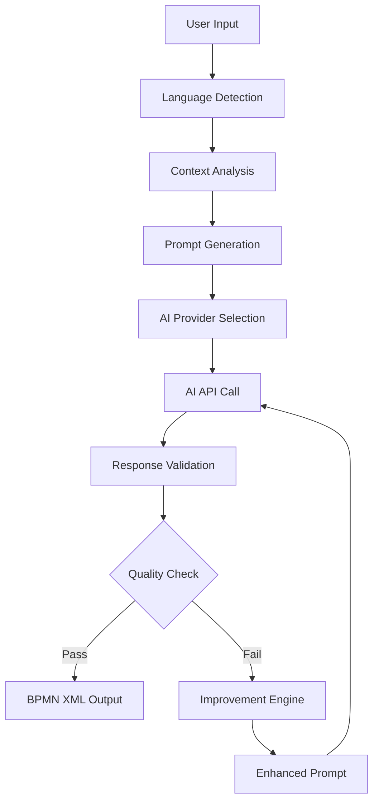
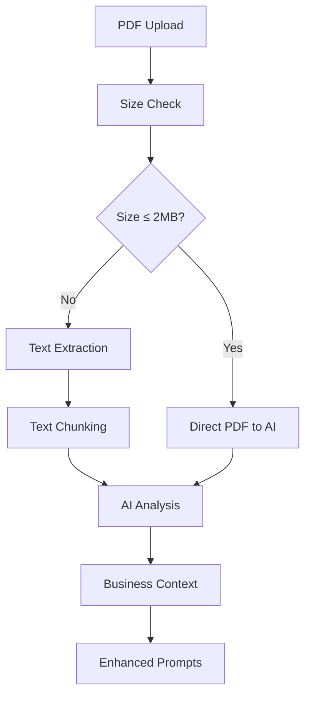
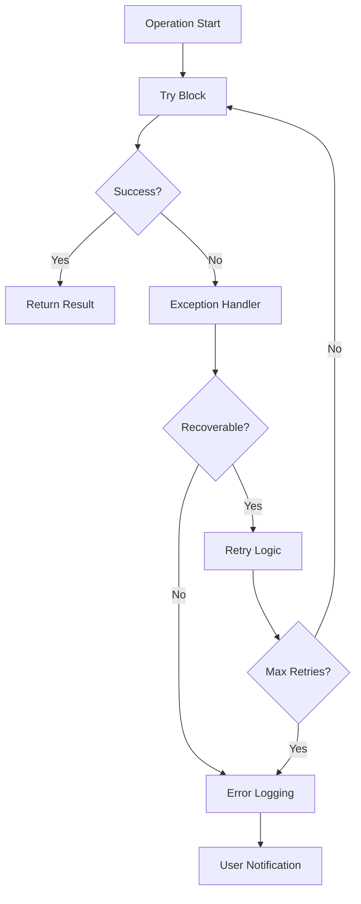

# Architektura Systemu - GD

## 📋 Przegląd Architektury

System GD został zaprojektowany jako modułowa, skalowalna platforma do automatycznego generowania diagramów UML i BPMN z wykorzystaniem sztucznej inteligencji. Architektura opiera się na zasadach separation of concerns, dependency injection i clean architecture.

## 🏗️ Architektura High-Level

```
┌─────────────────────────────────────────────────────────────────┐
│                     PRESENTATION LAYER                         │
├─────────────────────┬─────────────────────┬─────────────────────┤
│   Desktop App       │    Web App          │   API Endpoints     │
│   (PyQt5)           │   (Streamlit)       │   (Future: REST)    │
├─────────────────────┴─────────────────────┴─────────────────────┤
│                    APPLICATION LAYER                           │
├─────────────────────┬─────────────────────┬─────────────────────┤
│  BPMN v2 Engine     │  PlantUML Generator │  PDF Processor      │
│  - Iterative        │  - Multi-format     │  - Text Extraction  │
│    Optimization     │  - Templates        │  - AI Analysis      │
│  - Quality Scoring  │  - Validation       │  - Context Enhance  │
├─────────────────────┴─────────────────────┴─────────────────────┤
│                      SERVICE LAYER                             │
├─────────────────────┬─────────────────────┬─────────────────────┤
│   AI Integration    │   Config Management │   Utils & Helpers   │
│   - Multi-provider  │   - Environment     │   - Logging         │
│   - Dynamic Config  │   - Dynamic Loading │   - Metrics         │
│   - Failover        │   - Validation      │   - File Handling   │
├─────────────────────┴─────────────────────┴─────────────────────┤
│                       DATA LAYER                               │
├─────────────────────┬─────────────────────┬─────────────────────┤
│   File System       │   External APIs     │   Configuration     │
│   - Templates       │   - OpenAI          │   - Environment     │
│   - Output Files    │   - Google Gemini   │   - Prompts         │
│   - Logs & Metrics  │   - Anthropic       │   - Translations    │
└─────────────────────┴─────────────────────┴─────────────────────┘
```

---

## 🔧 Komponenty Główne

### 1. Presentation Layer

#### Desktop Application (PyQt5)
- **Lokalizacja**: `src/main.py`
- **Klasa główna**: `AIApp(QMainWindow)`
- **Odpowiedzialność**: Native desktop interface

**Kluczowe funkcje:**
- Rich GUI z zakładkami i kontrolami
- Real-time diagram preview
- Local file operations
- PDF analysis integration
- Conversation history management

**Architektura komponentu:**
```python
class AIApp(QMainWindow):
    # Main application window
    └── QTabWidget (main_tabs)
        ├── UML/BPMN Tab
        │   ├── Template Selector
        │   ├── Input Box (QTextEdit)
        │   ├── Generate Button
        │   └── Progress Bar
        ├── PDF Analysis Tab
        │   ├── File Upload
        │   ├── Analysis Progress
        │   └── Results Display
        ├── Output Tab
        │   ├── Generated Code Display
        │   ├── SVG Preview
        │   └── Save/Export Options
        └── Settings Tab
            ├── AI Provider Config
            ├── Quality Settings
            └── Language Selection
```

#### Web Application (Streamlit)
- **Lokalizacja**: `src/streamlit_app.py`
- **Odpowiedzialność**: Cross-platform web interface

**Kluczowe funkcje:**
- Responsive web design
- Real-time progress tracking
- Multi-user session support
- Cloud deployment ready

**Architektura komponentu:**
```python
def main():
    # Streamlit app structure
    └── Sidebar Configuration
        ├── AI Provider Selection
        ├── Quality Parameters
        └── Language Settings
    └── Main Content
        ├── Diagram Type Selection
        ├── Input Interface
        ├── BPMN v2 Controls
        ├── PDF Upload Interface
        └── Results Display
            ├── Generated Diagrams
            ├── Quality Metrics
            └── Download Options
```

### 2. Application Layer

#### BPMN v2 Engine
- **Lokalizacja**: `bpmn_v2/`
- **Klasa główna**: `BPMNv2Pipeline`
- **Odpowiedzialność**: Advanced BPMN generation with quality optimization

**Komponenty:**
```python
bpmn_v2/
├── complete_pipeline.py      # Main pipeline orchestration
├── ai_integration.py         # AI provider integration
├── bpmn_compliance_validator.py  # Quality validation
├── bpmn_improvement_engine.py    # Iterative improvement
├── json_to_bpmn_generator.py     # XML generation
├── structure_definition.py       # BPMN structures
├── polish_dictionary.py          # Domain terminology
└── json_prompt_template.py       # Prompt optimization
```

**Pipeline Flow:**
```
Polish Description
        ↓
Context Analysis (PolishToBPMNDictionary)
        ↓
AI Prompt Generation (PromptGenerator)
        ↓
AI Processing (AIClientFactory)
        ↓
JSON Response Validation (ResponseValidator)
        ↓
BPMN XML Generation (BPMNJSONConverter)
        ↓
Quality Assessment (BPMNComplianceValidator)
        ↓
Iterative Improvement (BPMNImprovementEngine)
        ↓
Final BPMN XML Output
```

#### PlantUML Generator
- **Lokalizacja**: `src/main.py`, `utils/plantuml/`
- **Odpowiedzialność**: UML diagram generation

**Supported Diagram Types:**
- Sequence Diagrams
- Activity Diagrams
- Class Diagrams
- Component Diagrams
- Use Case Diagrams
- State Diagrams

#### PDF Processor
- **Lokalizacja**: `utils/pdf/`
- **Klasa główna**: `AIPDFAnalyzer`
- **Odpowiedzialność**: PDF document analysis and context extraction

**Komponenty:**
```python
utils/pdf/
├── ai_pdf_analyzer.py     # Main analyzer
├── pdf_extractor.py       # Text extraction
└── pdf_context_server.py  # MCP server integration
```

**Analysis Flow:**
```
PDF File Input
        ↓
Size/Model Capability Check
        ↓
    [≤2MB + Gemini]     [>2MB or Other Models]
        ↓                      ↓
Direct PDF Analysis    Text Extraction
        ↓                      ↓
AI Context Analysis ←──────────┘
        ↓
Business Context Output
        ↓
Enhanced Diagram Prompts
```

### 3. Service Layer

#### AI Integration
- **Lokalizacja**: `bpmn_v2/ai_integration.py`, `bpmn_v2/ai_config.py`
- **Odpowiedzialność**: Multi-provider AI integration

**Supported Providers:**
```python
class AIProvider(Enum):
    OPENAI = "openai"     # GPT-4, GPT-3.5
    GEMINI = "gemini"     # Gemini 2.0 Flash, 1.5 Pro
    CLAUDE = "claude"     # Claude 3.5 Sonnet
    OLLAMA = "ollama"     # Local models
    MOCK = "mock"         # Testing
```

**Provider Factory Pattern:**
```python
class AIClientFactory:
    @staticmethod
    def create_client(config: AIConfig) -> AIClient:
        providers = {
            AIProvider.OPENAI: OpenAIClient,
            AIProvider.GEMINI: GeminiClient,
            AIProvider.CLAUDE: ClaudeClient,
            AIProvider.OLLAMA: OllamaClient,
            AIProvider.MOCK: MockAIClient
        }
        return providers[config.provider](config)
```

#### Configuration Management
- **Lokalizacja**: `bpmn_v2/ai_config.py`, `language/`
- **Odpowiedzialność**: Dynamic configuration and localization

**Configuration Sources:**
1. Environment variables (`.env`)
2. Command line arguments
3. GUI settings
4. Default fallbacks

**Localization Support:**
- Polish (`language/translations_pl.py`)
- English (`language/translations_en.py`)
- Dynamic language switching

#### Utilities & Helpers
- **Lokalizacja**: `utils/`
- **Odpowiedzialność**: Cross-cutting concerns

**Key Utilities:**
```python
utils/
├── logger_utils.py           # Centralized logging
├── extract_code_from_response.py  # Code extraction
├── metrics/                  # Performance tracking
├── db/                       # Database utilities
└── xmi/                      # XMI file handling
```

### 4. Data Layer

#### File System
- **Struktura katalogów:**
```
GD/
├── examples/          # Sample diagrams
├── logs/             # Application logs
├── cache/            # Temporary files
├── temp_xmi_files/   # XMI output
├── prompts/          # Prompt templates
└── config/           # Configuration files
```

#### External APIs
- **OpenAI GPT API**: `https://api.openai.com/v1/`
- **Google Gemini API**: `https://generativelanguage.googleapis.com/v1beta/`
- **Anthropic Claude API**: `https://api.anthropic.com/v1/`
- **Ollama Local API**: `http://localhost:11434/`

#### Configuration Files
- **Environment**: `.env`
- **Prompts**: `prompts/prompt_templates_*.py`
- **Requirements**: `config/requirements.txt`

---

## 🔄 Data Flow Patterns

### 1. BPMN Generation Flow



### 2. PDF Analysis Flow



### 3. Error Handling Flow



---

## 🏛️ Architectural Patterns

### 1. Factory Pattern
**Użycie**: AI Client Creation, Provider Selection

```python
class AIClientFactory:
    @staticmethod
    def create_client(config: AIConfig) -> AIClient:
        # Dynamic client creation based on configuration
```

### 2. Strategy Pattern
**Użycie**: Different AI providers, PDF processing strategies

```python
class PDFAnalysisStrategy:
    def analyze(self, pdf_path: str) -> Dict[str, Any]:
        # Different strategies for different file sizes/models
```

### 3. Observer Pattern
**Użycie**: Progress tracking, event notifications

```python
class BPMNGenerationProgress:
    def __init__(self):
        self._observers = []
    
    def notify_progress(self, progress: float):
        # Notify all registered observers
```

### 4. Template Method Pattern
**Użycie**: Prompt generation, diagram templates

```python
class DiagramTemplate:
    def generate_prompt(self, description: str) -> str:
        # Template method with hooks for customization
```

---

## 🔧 Integration Patterns

### 1. Configuration Injection

```python
class Component:
    def __init__(self, config: ConfigInterface):
        self.config = config
        # Dependencies injected, not hard-coded
```

### 2. Event-Driven Architecture

```python
class EventBus:
    def __init__(self):
        self.handlers = {}
    
    def emit(self, event: str, data: Any):
        # Loose coupling through events
```

### 3. Plugin Architecture

```python
class PluginManager:
    def load_plugins(self, plugin_dir: str):
        # Dynamic plugin loading
        # Extensible without core changes
```

---

## 📊 Performance Patterns

### 1. Caching Strategy

```python
from functools import lru_cache

@lru_cache(maxsize=128)
def expensive_operation(input_hash: str):
    # Memory-based caching for expensive operations
```

### 2. Lazy Loading

```python
class ModelManager:
    @property
    def model(self):
        if self._model is None:
            self._model = self.load_model()
        return self._model
```

### 3. Async Processing

```python
async def generate_diagram_async(prompt: str):
    # Non-blocking operations for better UX
```

---

## 🔐 Security Patterns

### 1. Credential Management

```python
class SecureConfig:
    def __init__(self):
        self.api_key = os.getenv("API_KEY")
        # No secrets in code
```

### 2. Input Validation

```python
def validate_input(user_input: str) -> str:
    # Sanitize and validate all user inputs
    return sanitized_input
```

### 3. Error Information Filtering

```python
def safe_error_message(error: Exception) -> str:
    # Don't expose sensitive information in errors
    return filtered_message
```

---

## 🧪 Testing Architecture

### 1. Test Pyramid

```
                    E2E Tests
                      ▲
                 Integration Tests  
                      ▲
                   Unit Tests
```

**Unit Tests**: Individual component testing
- **Lokalizacja**: `tests/unit/`
- **Framework**: pytest
- **Coverage**: >90%

**Integration Tests**: Component interaction testing
- **Lokalizacja**: `tests/integration/`
- **Focus**: API integrations, file operations

**End-to-End Tests**: Full workflow testing
- **Lokalizacja**: `tests/system/`
- **Tools**: Selenium (future), API testing

### 2. Test Fixtures

```python
@pytest.fixture
def mock_ai_client():
    return MockAIClient()

@pytest.fixture
def sample_pdf():
    return Path("test_files/sample.pdf")
```

### 3. Mock Strategy

```python
class MockAIClient(AIClient):
    def send_request(self, prompt: str) -> AIResponse:
        # Predictable responses for testing
        return self.generate_mock_response()
```

---

## 📈 Scalability Patterns

### 1. Horizontal Scaling

```python
class LoadBalancer:
    def __init__(self, ai_clients: List[AIClient]):
        self.clients = ai_clients
        self.current = 0
    
    def get_client(self) -> AIClient:
        # Round-robin load balancing
```

### 2. Circuit Breaker

```python
class CircuitBreaker:
    def __init__(self, failure_threshold: int = 5):
        self.failure_count = 0
        self.threshold = failure_threshold
        self.state = "CLOSED"
    
    def call(self, func, *args, **kwargs):
        # Prevent cascade failures
```

### 3. Rate Limiting

```python
class RateLimiter:
    def __init__(self, max_calls: int, time_window: int):
        # Prevent API quota exhaustion
```

---

## 🌐 Deployment Architecture

### 1. Container Strategy

```dockerfile
FROM python:3.11-slim
WORKDIR /app
COPY requirements.txt .
RUN pip install -r requirements.txt
COPY . .
CMD ["streamlit", "run", "src/streamlit_app.py"]
```

### 2. Environment Configuration

```yaml
# docker-compose.yml
services:
  gd-python:
    build: .
    environment:
      - MODEL_PROVIDER=${MODEL_PROVIDER}
      - GOOGLE_API_KEY=${GOOGLE_API_KEY}
    volumes:
      - ./logs:/app/logs
```

### 3. Health Monitoring

```python
def health_check() -> Dict[str, str]:
    return {
        "status": "healthy",
        "version": "4.0.0",
        "ai_provider": get_current_provider(),
        "timestamp": datetime.utcnow().isoformat()
    }
```

---

## 🔍 Monitoring & Observability

### 1. Logging Strategy

```python
import logging

logger = logging.getLogger(__name__)

def generate_diagram(prompt: str):
    logger.info(f"Starting diagram generation for prompt: {prompt[:50]}...")
    try:
        # Process
        logger.info("Diagram generated successfully")
    except Exception as e:
        logger.error(f"Diagram generation failed: {e}")
```

### 2. Metrics Collection

```python
from prometheus_client import Counter, Histogram

generation_requests = Counter('diagram_generation_requests_total')
generation_duration = Histogram('diagram_generation_duration_seconds')
```

### 3. Error Tracking

```python
def track_error(error: Exception, context: Dict[str, Any]):
    # Centralized error tracking
    error_tracker.capture_exception(error, extra=context)
```

---

## 🎯 Architecture Benefits

### 1. Maintainability
- **Modular Design**: Each component has single responsibility
- **Loose Coupling**: Components communicate through well-defined interfaces
- **Clear Separation**: Presentation, business logic, and data layers separated

### 2. Scalability
- **Horizontal Scaling**: Multiple AI providers, load balancing
- **Performance**: Caching, async operations, lazy loading
- **Resource Management**: Efficient memory and API quota usage

### 3. Extensibility
- **Plugin Architecture**: Easy addition of new AI providers
- **Template System**: Customizable prompts and diagram templates
- **Configuration Driven**: Behavior modification without code changes

### 4. Reliability
- **Error Handling**: Comprehensive exception management
- **Failover**: Multiple provider support with automatic fallback
- **Testing**: Extensive test coverage with multiple test levels

### 5. Security
- **Credential Management**: Secure API key handling
- **Input Validation**: All user inputs sanitized
- **Privacy**: No sensitive data logging or storage

Ta architektura zapewnia solidną podstawę dla systemu GD, umożliwiając łatwe utrzymanie, rozwój i wdrażanie w różnych środowiskach.