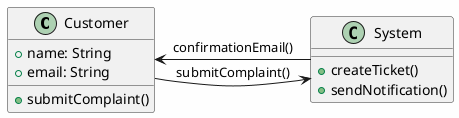

# Przewodnik Użytkownika - Aplikacja Web Streamlit

## 🌐 Dostęp do Aplikacji

### Uruchomienie Lokalnie

```bash
# W katalogu projektu
streamlit run streamlit_app.py

# Lub z określonym portem
streamlit run streamlit_app.py --server.port 8502

# Z custom konfiguracją
streamlit run streamlit_app.py --server.address 0.0.0.0
```

**Dostęp:** `http://localhost:8501`

### Dostęp do Instancji Zdalnej

**URL Production:** `https://gd-python.yourcompany.com`
**URL Staging:** `https://staging.gd-python.yourcompany.com`
**URL Development:** `http://dev.gd-python.yourcompany.com:8501`

## 🎨 Interfejs Użytkownika

### Layout Główny

**Struktura strony:**
1. **Sidebar** (lewy panel)
   - Konfiguracja AI Provider
   - Ustawienia językowe  
   - Opcje BPMN
   - Upload PDF

2. **Main Panel** (środek)
   - Pole opisu procesu
   - Przyciski generowania
   - Wyświetlanie wyników

3. **Status Bar** (dół)
   - Informacje o sesji
   - Status połączenia
   - Progress indicators

### Responsywność

**Desktop (1200px+):**
- Pełny sidebar
- Podgląd bok w bok
- Wszystkie funkcje dostępne

**Tablet (768px - 1199px):**
- Collapsible sidebar
- Pionowy layout
- Uproszczone menu

**Mobile (< 768px):**
- Hidden sidebar (toggle)
- Single column layout
- Touch-optimized controls

## ⚙️ Konfiguracja AI Provider

### Sidebar Configuration

#### 1. Wybór Provider

**Lokalizacja:** Sidebar → "🤖 Konfiguracja AI"

**Dostępne opcje:**
```
🔵 OpenAI GPT-4 (Premium)
🟡 Google Gemini (Recommended)  
🟣 Anthropic Claude
🔶 Ollama (Local)
```

**Wskazówki wyboru:**
- **Gemini**: Dobry balans jakości/kosztu, darmowy tier
- **OpenAI**: Najwyższa jakość, wymaga płatnego API
- **Claude**: Bardzo dobra analiza tekstu, średni koszt
- **Ollama**: Darmowy, ale wymaga lokalnej instalacji

#### 2. Ustawienia Modelu

**Po wyborze providera:**
- **Model**: Automatycznie ustawiony optymalny
- **Temperature**: 0.7 (domyślna, zalecana)
- **Max Tokens**: Dostosowane do providera

**Zaawansowane (rozwijane):**
```python
# Przykład custom settings
Temperature: 0.8          # Wyższa kreatywność
Max Tokens: 4000          # Dłuższe odpowiedzi
Top-p: 0.9               # Nucleus sampling
```

#### 3. Test Połączenia

**Przycisk:** "🔍 Testuj Połączenie"

**Wyniki testu:**
- ✅ **Sukces**: "Połączenie z {provider} działa poprawnie"
- ❌ **Błąd**: Szczegóły problemu i sugestie rozwiązania
- ⚠️ **Ostrzeżenie**: Połączenie działa, ale wykryto problemy

## 📝 Generowanie Diagramów

### PlantUML Generation

#### 1. Podstawowy Workflow

**Krok 1: Opis Procesu**
```
Przykład dobrego opisu:

Proces obsługi reklamacji:

1. Klient zgłasza reklamację przez formularz online
2. System automatycznie tworzy ticket
3. Zespół obsługi klienta weryfikuje zgłoszenie
4. Jeśli reklamacja uzasadniona:
   - Autoryzuje zwrot/wymianę
   - Wysyła etykietę zwrotną
5. Jeśli reklamacja nieuzasadniona:
   - Wysyła odrzucenie z uzasadnieniem
6. Klient odsyła produkt
7. Magazyn sprawdza stan produktu
8. Przetwarzanie zwrotu pieniędzy/wymiany
9. Zamknięcie ticket

Uczestnicy:
- Klient
- System CRM  
- Obsługa klienta
- Magazyn
```

**Krok 2: Wybór Typu Diagramu**

**Activity Diagram** - dla procesów biznesowych:
```
✅ Używaj gdy:
- Modelujesz przepływ pracy
- Masz punkty decyzyjne
- Procesu uczestniczą różni aktorzy

📋 Otrzymasz:
- Swimlanes dla uczestników
- Decision diamonds  
- Start/end states
- Flow arrows
```

**Sequence Diagram** - dla interakcji systemowych:
```
✅ Używaj gdy:
- Masz interakcje między systemami
- Ważna jest kolejność wywołań
- Analizujesz API lub protokoły

📋 Otrzymasz:
- Lifelines dla objektów
- Message arrows
- Activation boxes
- Return messages
```

**Class Diagram** - dla modelowania danych:
```
✅ Używaj gdy:
- Projektujesz model danych
- Analizujesz relacje między objektami
- Dokumentujesz architekturę

📋 Otrzymasz:
- Klasy z atrybutami/metodami
- Relationships (association, inheritance)
- Multiplicities
- Stereotypes
```

**Krok 3: Generowanie**
1. Kliknij **"🚀 Generuj PlantUML"**
2. Obserwuj progress bar (5-30 sekund)
3. Sprawdź wynik w sekcji "Wyniki"

#### 2. Wyświetlanie Wyników

**Tabs rezultatu:**
- **📊 Podgląd**: Graficzna wizualizacja (SVG)
- **📝 Kod PlantUML**: Edytowalny kod źródłowy
- **📋 Info**: Metadane (model, czas generacji, etc.)

**Podgląd interaktywny:**
- **Zoom**: Mouse wheel lub przyciski +/-
- **Pan**: Przeciągnij diagram
- **Full Screen**: Kliknij ikonę expand

**Edycja kodu:**


### BPMN Generation (v2)

#### 1. Enhanced Input

**Rozszerzony formularz BPMN:**
```
🎯 Tytuł procesu:
Proces onboarding nowego pracownika

📖 Szczegółowy opis:
[Wprowadź tutaj szczegółowy opis - minimum 3-5 zdań]

👥 Pule odpowiedzialności (Pools):
- HR Department
- IT Department  
- Manager
- New Employee

🔧 Systemy/Narzędzia:
- HRIS System
- Active Directory
- Email System
- Training Platform

📋 Kluczowe aktywności:
- Przygotowanie stanowiska pracy
- Utworzenie konta systemowego
- Przeprowadzenie szkolenia wstępnego
- Przypisanie mentora
```

#### 2. Konfiguracja BPMN

**Sidebar → "⚙️ Ustawienia BPMN"**

**Quality Settings:**
```
Próg jakości: ████████░░ 0.8     (0.7-0.95)
   ↳ 0.7: Podstawowa jakość (szybciej)
   ↳ 0.8: Produkcja (zalecane)  
   ↳ 0.9: Wysoka jakość (wolniej)

Maksymalne iteracje: 10          (5-20)
   ↳ Więcej iteracji = lepsza jakość + dłuższy czas

Typ procesu:
○ Business Process (domyślny)
○ Technical Workflow  
○ Decision Process
```

**Advanced Options (rozwijane):**
```
Obszar optymalizacji:
☑️ Struktura procesu
☑️ Nazwy aktywności  
☑️ Przepływ kontroli
☑️ Zgodność BPMN 2.0

Automatic Features:
☑️ Auto-validation
☑️ Auto-improvement
☑️ Save iterations
```

#### 3. Proces Generowania

**Real-time Progress:**
```
🔄 Generating BPMN...
Progress: ████████████░░░░ 75%

Current step: Quality optimization (iteration 3/10)
Quality score: 0.82 (target: 0.85)
Elapsed time: 45 seconds

[Cancel Process] [Use Current Result]
```

**Iterative Improvement Log:**
```
Iteration 1: Quality 0.65 → Improving activity names
Iteration 2: Quality 0.72 → Optimizing flow structure  
Iteration 3: Quality 0.82 → Adding decision gateways
Iteration 4: Quality 0.87 → ✅ Target reached!
```

#### 4. BPMN Results

**Enhanced Result Display:**
```
📊 BPMN Quality Score: ████████▌░ 0.87/1.0

📈 Improvement History:
0.65 → 0.72 → 0.82 → 0.87 (4 iterations)

⏱️ Generation Time: 1 min 23 sec

🎯 Target Quality: 0.8 (✅ Achieved)

📋 Validation Results:
✅ BPMN 2.0 compliant
✅ All gateways properly connected
✅ Valid start/end events
⚠️ Consider adding intermediate events
```

**BPMN Tabs:**
- **🎨 Diagram**: SVG visualization
- **📄 BPMN XML**: Raw BMPN 2.0 code
- **📊 Quality Report**: Detailed quality analysis
- **📈 Iterations**: History of improvements

## 📎 PDF Integration

### Upload PDF Documents

#### 1. File Upload

**Metody upload:**
- **Drag & Drop**: Przeciągnij pliki do obszaru upload
- **Browse**: Kliknij "Browse files"
- **Multiple Files**: Wybierz wiele plików jednocześnie

**Supported formats:**
```
✅ PDF (główny format)
✅ TXT (dodatkowy tekst)
✅ DOC/DOCX (z konwersją)
⚠️ Max file size: 100MB
⚠️ Max pages: 50 (konfigurowane)
```

#### 2. PDF Processing Options

**Sidebar → "📄 Ustawienia PDF"**

```
📄 Processing Mode:
○ AI Analysis (zalecane)
○ Basic Text Extraction

📊 Extract Tables: ☑️ Yes / ☐ No

📏 Max Pages: [50        ] (1-200)

🔍 Analysis Focus:
☑️ Business Processes
☑️ System Interactions  
☑️ Data Models
☑️ Requirements
```

#### 3. PDF Analysis Results

**Po przesłaniu pliku:**
```
📄 Document: "Business_Requirements_v2.pdf"
📊 Status: ✅ Processed (34 pages, 2 tables)
⏱️ Processing time: 12 seconds

🔍 Extracted Information:
📋 Identified Processes (5):
  • Customer Registration Process
  • Order Fulfillment Process
  • Return Authorization Process
  • Inventory Management Process
  • Monthly Reporting Process

👥 Stakeholders (8):
  • Customer Service Team
  • Warehouse Staff
  • Finance Department
  • IT Support
  • [View all...]

🔧 Systems Mentioned (6):
  • CRM System
  • ERP System  
  • Email Gateway
  • Payment Processor
  • [View all...]
```

#### 4. Context Enhancement

**Automatic Context Injection:**
```
ℹ️ PDF Context Available
The uploaded document has been analyzed and key information 
will be automatically included in diagram generation.

Found content will enhance:
✅ Process descriptions
✅ Actor identification  
✅ System boundaries
✅ Business rules

[View Extracted Context] [Disable Auto-Enhancement]
```

**Manual Context Review:**
```markdown
## Extracted Business Context

### Main Process: Customer Order Fulfillment
- **Trigger**: Customer places order online
- **Actors**: Customer, Sales Rep, Warehouse, Finance
- **Systems**: E-commerce Platform, ERP, Payment Gateway
- **Business Rules**: 
  - Orders >$1000 require manager approval
  - International orders need customs documentation
  
### Quality Requirements:
- Order processing time < 24 hours
- Error rate < 2%
- Customer satisfaction > 95%
```

## 💾 Export & Download

### Export Options

#### 1. Single File Export

**Po generacji diagramu:**
```
📥 Download Options:
┌─────────────────────────────────┐
│ 📄 PlantUML Source (.puml)     │
│ 🎨 SVG Vector (.svg)           │  
│ 🖼️ PNG Image (.png)            │
│ 📋 PDF Document (.pdf)         │
└─────────────────────────────────┘

┌─────────────────────────────────┐
│ 📊 BPMN XML (.bpmn)            │
│ 🎨 SVG Diagram (.svg)          │
│ 📋 Enterprise Architect (.xmi) │
│ 📄 Quality Report (.html)      │
└─────────────────────────────────┘
```

**Download behavior:**
- **Automatic filename**: `process_diagram_20241201_143022.svg`
- **Custom filename**: Editable before download
- **Multiple formats**: Shift+click for multiple selections

#### 2. Batch Export

**Session Export Feature:**
```
📦 Export Session Data

☑️ All generated diagrams (3 items)
☑️ Source code files  
☑️ Quality reports
☐ PDF analysis results
☐ Configuration backup

📁 Export format:
○ Separate files
● ZIP archive (recommended)

[📥 Export All]
```

#### 3. Integration Export

**For external systems:**
```
🔗 Integration Formats:

Enterprise Architect:
📄 XMI 2.1 Export → .xmi file

Confluence/Wiki:
📋 Embedded SVG code
🔗 Direct image links

Microsoft Visio:
📄 SVG → Import to Visio

Lucidchart:
📋 PlantUML import support
```

## 🔧 Advanced Features

### Session Management

#### 1. Session State

**Automatic preservation:**
```
💾 Session State (Auto-saved)
┌─────────────────────────────────┐
│ 🕐 Last activity: 2 minutes ago │
│ 📊 Diagrams generated: 5        │
│ 🤖 Current provider: Gemini     │
│ 📄 PDFs loaded: 2              │
│ ⚙️ Custom settings: 3           │
└─────────────────────────────────┘

🔄 Auto-save every 30 seconds
💾 Session expires after 24 hours
```

#### 2. History Panel

**Sidebar → "📜 Session History"**
```
📊 Recent Generations:
┌─────────────────────────────────┐
│ 🕐 14:23 - Order Process (BPMN) │
│ 🎯 Quality: 0.87 | ⏱️ 1m 15s    │
│ [View] [Re-export] [Delete]     │
├─────────────────────────────────│
│ 🕐 14:18 - User Login (PlantUML)│
│ 📊 Activity Diagram | ⏱️ 23s    │
│ [View] [Re-export] [Delete]     │
├─────────────────────────────────│
│ 🕐 14:12 - API Sequence        │
│ 📊 Sequence Diagram | ⏱️ 18s   │
│ [View] [Re-export] [Delete]     │
└─────────────────────────────────┘

[Clear History] [Export All]
```

#### 3. Comparison View

**Compare generated versions:**
```
📊 Comparison: Order Process v1 vs v2

Side-by-side view:
┌─────────────────┬─────────────────┐
│ Version 1       │ Version 2       │
│ Quality: 0.72   │ Quality: 0.87   │
│ 4 activities    │ 6 activities    │
│ 2 gateways      │ 4 gateways      │
│                 │                 │
│ [Diagram 1]     │ [Diagram 2]     │
└─────────────────┴─────────────────┘

🔍 Changes detected:
+ Added intermediate events
+ Improved gateway logic
+ Enhanced activity names
```

### Quality Analytics

#### 1. Quality Dashboard

**Sidebar → "📈 Quality Analytics"**
```
📊 Quality Trends (Last 10 generations)

BPMN Quality:
████████████████░░ 0.85 avg (↗️ +0.12)

PlantUML Quality:
████████████░░░░░░ 0.73 avg (→ stable)

⏱️ Performance:
Average generation time: 45 seconds
Fastest: 12s | Slowest: 2m 15s

🎯 Success Rate: 94% (47/50)

📋 Common Issues:
• Low initial quality → Use more detailed descriptions
• Timeout errors → Try simpler processes first
• API limits → Consider switching providers
```

#### 2. Improvement Suggestions

**AI-powered recommendations:**
```
💡 Suggestions for Better Results:

For your current process description:
✅ Add more detail about decision points
✅ Specify actor responsibilities clearly  
✅ Include exception handling scenarios
✅ Define process boundaries

📋 Template Suggestion:
Your description matches "Customer Service Process" template.
Using this template could improve quality by ~15%.

[Apply Template] [Learn More]
```

### Collaborative Features

#### 1. Share Session

**Generate shareable links:**
```
🔗 Share Session

Public link (read-only):
https://gd-python.com/share/abc123xyz789

Valid for: [7 days ▼]

☑️ Include generated diagrams
☑️ Include PDF context  
☐ Include configuration
☐ Allow downloads

[Copy Link] [Generate QR Code]
```

#### 2. Export for Team

**Team collaboration export:**
```
👥 Team Export Package

📦 Includes:
✅ All diagrams (5 files)
✅ Source code (.puml/.bpmn)
✅ Quality reports
✅ Session summary
✅ Configuration template

📄 Documentation:
✅ Auto-generated README
✅ Process descriptions
✅ Usage instructions

[📧 Email Package] [💾 Download ZIP]
```

## 🚨 Troubleshooting

### Frequent Issues

#### 1. "Connection Failed"

**Error display:**
```
❌ Connection Error
Unable to connect to OpenAI API

Possible causes:
• Invalid API key
• Network connectivity issues  
• API service temporarily unavailable
• Request quota exceeded

🔧 Quick fixes:
1. Check API key in sidebar
2. Test with different provider
3. Check internet connection
4. Try again in few minutes

[Test Connection] [Switch Provider] [Contact Support]
```

#### 2. "Generation Timeout"

**Timeout handling:**
```
⏱️ Generation Timeout (120 seconds)
Your process description might be too complex.

💡 Suggestions:
• Break down into smaller processes
• Reduce detail level temporarily
• Try different AI provider
• Increase timeout in advanced settings

[Retry] [Simplify Process] [Advanced Settings]
```

#### 3. "PDF Processing Failed"

**PDF error diagnostics:**
```
❌ PDF Processing Error
File: "complex_document.pdf"

📋 Detected Issues:
• File contains only scanned images (no text)
• Document is password protected
• File exceeds size limit (150MB > 100MB)

🔧 Solutions:
• Use OCR tool to convert images to text
• Remove password protection
• Split large documents into smaller files

[Try Different File] [Learn About OCR] [Contact Support]
```

### Self-Diagnostics

#### 1. System Status

**Status dashboard:**
```
🔍 System Diagnostics

🌐 Network:
✅ Internet connection: OK
✅ AI API endpoints: Reachable
⚠️ PlantUML online service: Slow (2.3s)

🤖 AI Providers:
✅ Gemini: OK (94ms response)
❌ OpenAI: API key invalid
✅ Claude: OK (156ms response)
⚠️ Ollama: Not configured

💾 Browser:
✅ LocalStorage: 2.3MB used / 10MB available
✅ Session data: Valid
✅ Cache: 15MB / 50MB

[Run Full Diagnostic] [Clear Cache] [Export Diagnostic Report]
```

#### 2. Performance Monitor

**Real-time performance:**
```
📊 Performance Monitor

⚡ Current Session:
- Generations: 8
- Average time: 34 seconds
- Success rate: 100%
- Data usage: 12.5 MB

🔄 Real-time Metrics:
- Memory usage: 45MB
- Network latency: 120ms
- API response: 1.2s average

[View Detailed Stats] [Reset Counters]
```

---

*Ten przewodnik obejmuje wszystkie funkcje aplikacji web Streamlit. Sprawdzaj regularnie aktualizacje funkcjonalności w aplikacji.*